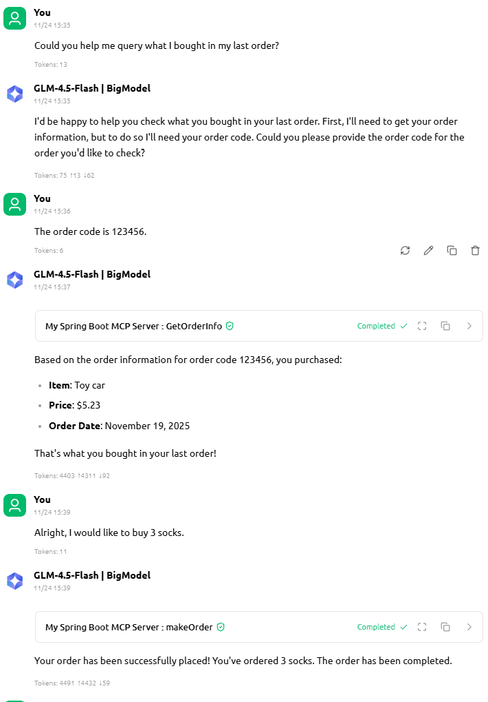
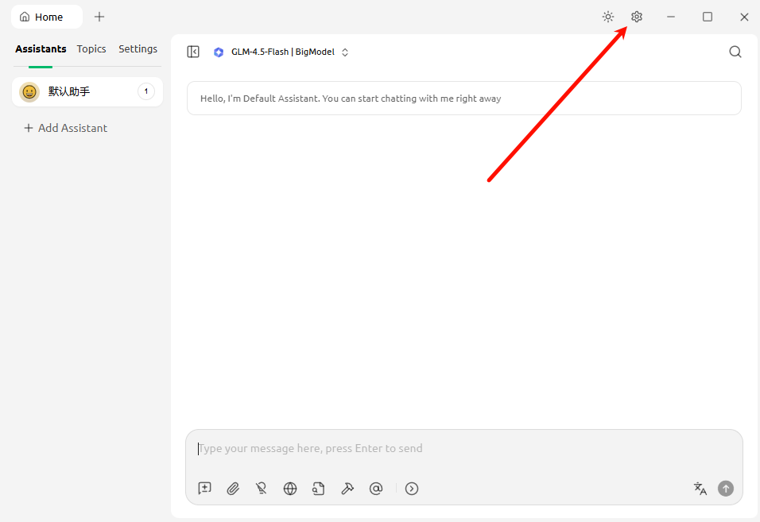
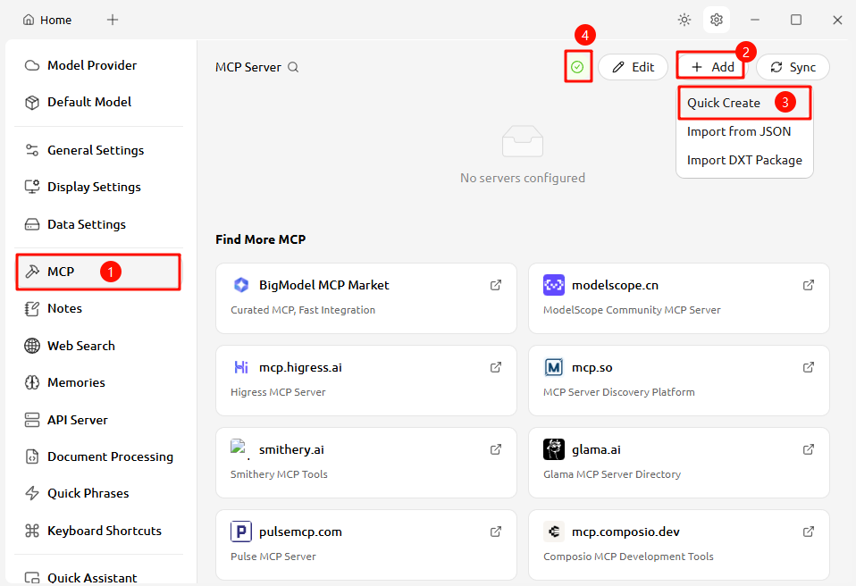
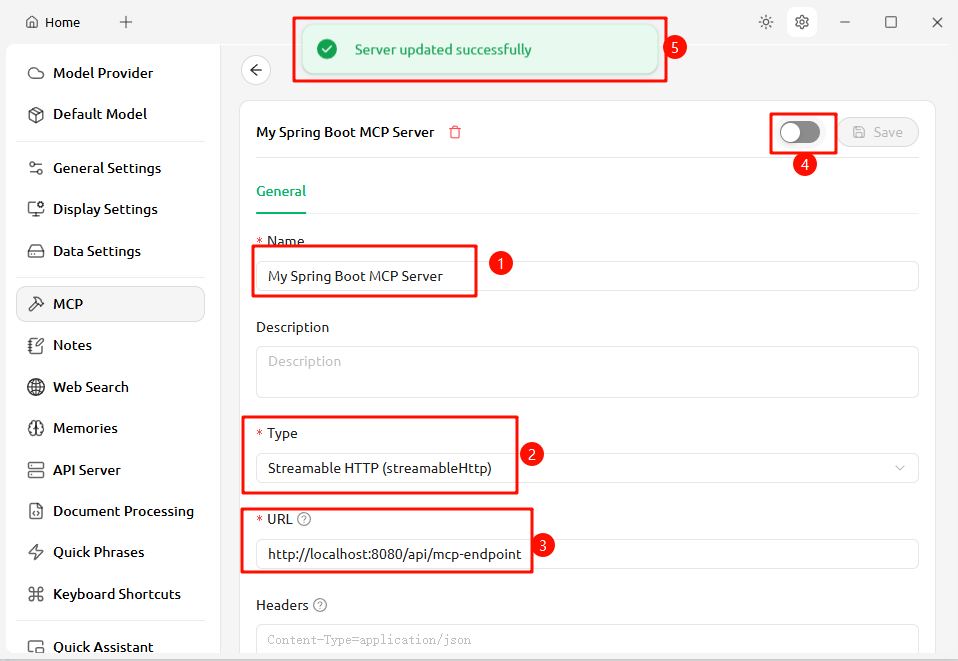
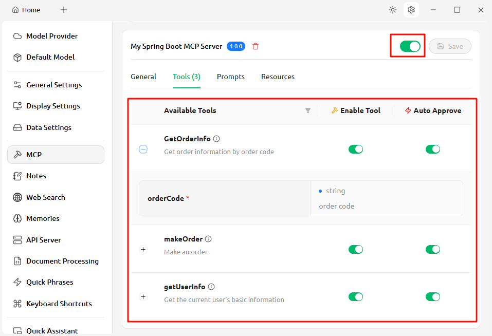
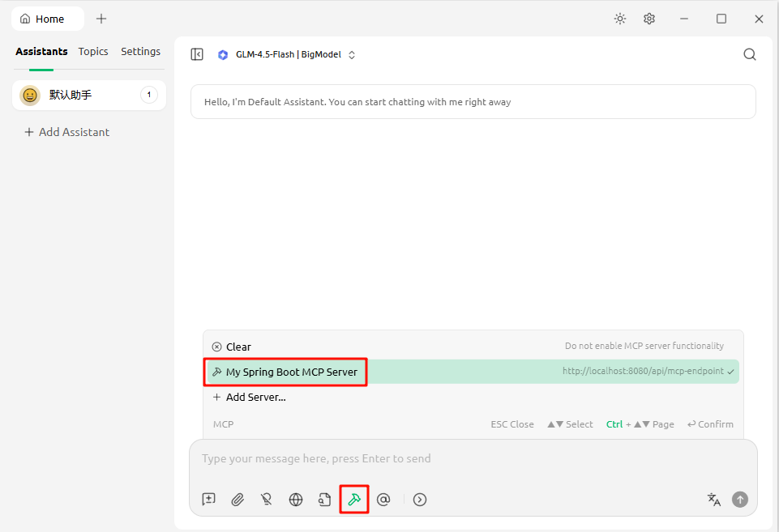
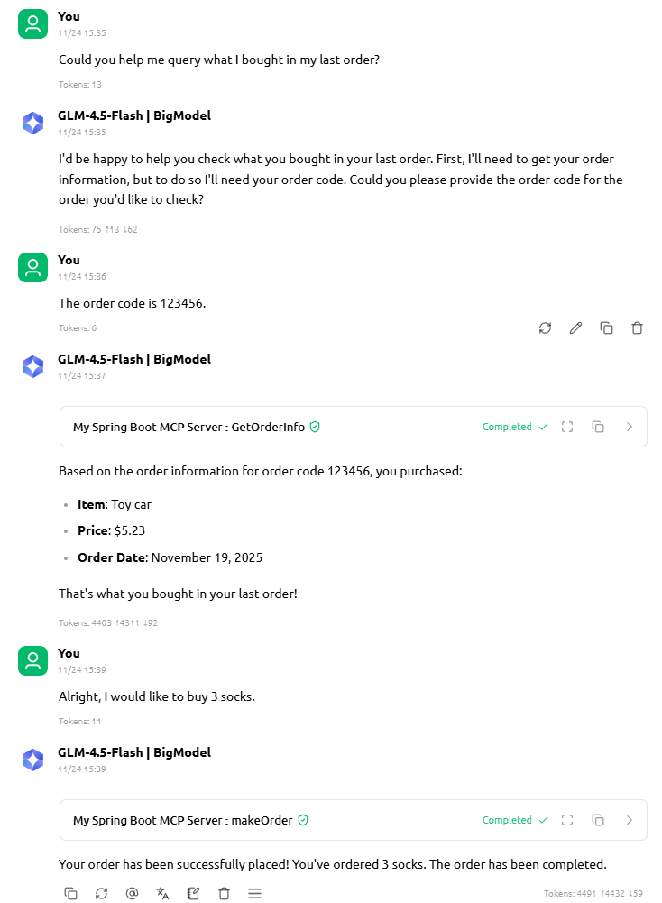
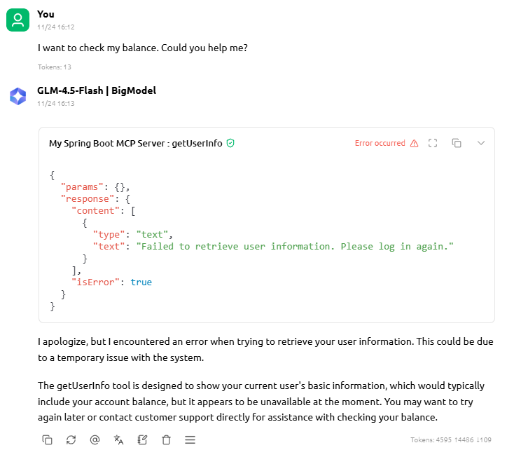
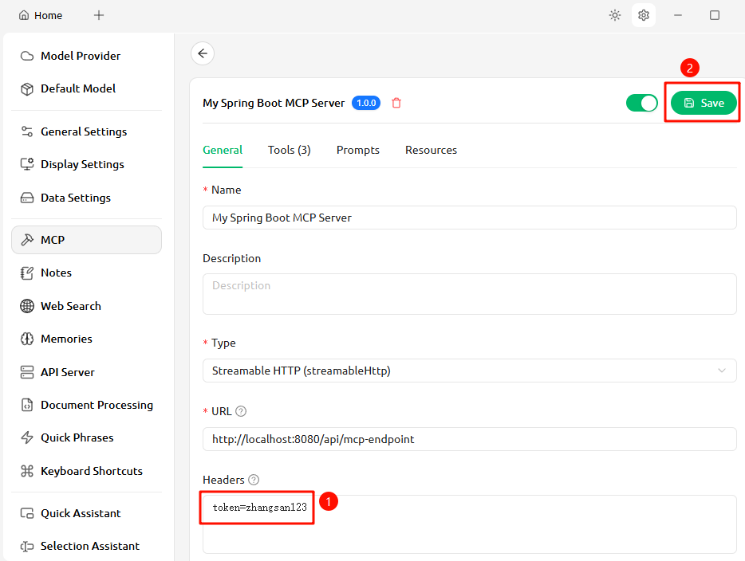
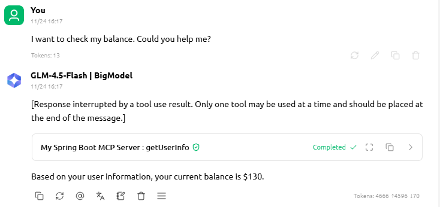

# 1. Article Overview

As we all know, large language models (LLMs) can be used to build Agents, allowing users to call tools through conversations with LLMs. However, many enterprises want to build their own LLMs that integrate with their business systems but don't where to start. 


After reading this article, you will learn:

1. What MCP is.
2. Using Spring AI to turn Spring Boot project into an MCP Server and expose selected APIs for LLM calls.
3. Use LLMs to implement actions like querying user information and placing orders.
4. How MCP Server obtain user's token from HTTP headers.

> Note: This article only covers the MCP Server implementation. We use Cherry Studio as the Client for demonstration. A follow-up article will explain how to build a custom MCP Client.

Final Result:




# 2. MCP Introduction

MCP is short for Large Language **M**odel **C**ontext **P**rotocol. It's a standard protocol designed by Anthropic (the company behind Claude) that unify the pattern that LLMs call external tools.

The MCP protocol has two main components:

1. **MCP Server**: Provides callable tools for LLMs (e.g., weather queries, order placement)
2. **MCP Client**: Acts as an intermediary to help LLMs call tools. Most mainstream LLM chat tools support MCP Client (e.g., Cursor, Claude Code).

This article focuses on exposing selected APIs from your Spring Boot project for LLM usage via MCP.


# 3. Environment Configuration

## 3.1 Project Dependencies

To use Spring AI, first upgrade Java and Spring Boot.

1. Java version >= 17 (Java 21 recommend).
2. Spring Boot version >= 3.5.0.

After upgrading, add the Spring AI dependency:

```xml
<dependency>
    <groupId>org.springframework.ai</groupId>
    <artifactId>spring-ai-starter-mcp-server-webmvc</artifactId>
    <version>1.1.0</version>
</dependency>
```

## 3.2 Simulated Service Class

Assume we have a Service class with two APIs: **querying order information** and **place an order**. The code is as follows:
```java
@Service
public class OrderService {

    private static final Logger logger = LoggerFactory.getLogger(OrderService.class);

    public Map<String, String> getOrderInfo(String orderCode) {
        logger.info("Query order info: {}", orderCode);
        return Map.of(
                "orderCode", orderCode,
                "createDate", "2025-11-19",
                "itemName", "Toy Car",
                "price", "$5.23"
        );
    }

    public void makeOrder(String itemName, Integer num) {
        logger.info("Make an order; itemName: {}, num: {}", itemName, num);
    }

}
```

Preparation is now complete.


# 4. Build MCP Server

## 4.1 Modify `application.yaml` to Start MCP Server

First add the following configuration to `application.yaml`:

```yaml
spring:
  ai:
    mcp:
      server:
        enabled: true  # Enable MCP Server
        protocol: STATELESS  # Use Stateless Streamable HTTP
        annotation-scanner:
          enabled: true  # Enable annotation scanning for @McpTool
        streamable-http:
          mcp-endpoint: /api/mcp-endpoint  # Define endpoint for MCP Client to discover available tools
        capabilities:
          tool: true  # Declare that this MCP Server provides tool capabilities
```

> Old tutorials may use SSE (Server-Sent Events), but this method will be deprecated due to high server resource consumption.


## 4.2 Create MCP Tool Class to Provide Tools

In Spring MVC projects, we provide `Controller` class to handle front-end calls. Similarly, as an MCP Server uses an `McpTool` class  to handle invocations from an MCP Client.

To declare a method as an MCP tool, simply use the `@McpTool` annotation. The annotation takes two key parameters:

- **name**: Tool name (defaults to the method name if not specified).
- **description**: Tool purpose (explains what the tool does).

For method parameters, use the `@McpToolParam` annotation with:

- **description**: Parameter explanation.
- **required**: Whether the parameter is mandatory (default: true).

Let's create an MCP Tool class as follows:
```java
import com.iioSnail.shop.service.OrderService;
import org.springaicommunity.mcp.annotation.McpTool;
import org.springaicommunity.mcp.annotation.McpToolParam;
import org.springframework.beans.factory.annotation.Autowired;
import org.springframework.stereotype.Service;

import java.util.Map;

@Service
public class OrderMcpTools {

    @Autowired
    private OrderService orderService;

    @McpTool(name = "GetOrderInfo", description = "Get order information by order code")
    public Map<String, String> getOrderInfo(@McpToolParam(description = "order code") String orderCode) {
        return orderService.getOrderInfo(orderCode);
    }

    @McpTool(name = "makeOrder", description = "Make an order")
    public void makeOrder(@McpToolParam(description = "item name") String itemName,
                          @McpToolParam(description = "Number to buy", required = false) Integer num) {
        if (num == null) {
            num = 1;
        }
        orderService.makeOrder(itemName, num);
    }

}

```

Alright, our MCP Server is complete. Let's start it up to test.

# 5. Test the MCP Server

In this article, we'll use Cherry Studio as our chat client to interact with LLMs. The detailed installation process is omitted here.

## 5.1 Config MCP Server

Cherry Studio is similar to other chat clients, like Claude Code. After starting it up, click the settings icon.



In the MCP menu, click the `Add` button, then `Quick Create`.



Note that if Button 4 is not green, you need to install UV and Bun first. To do this, click Button 4 and then click the install button.

Next, let's configure our MCP Server. We need to configure three main fields:

- **Name**: A random name.
- **Type**: Select "Streamable HTTP" because our MCP Server is of that type.
- **URL**: The endpoint of the MCP Server that we configured in the `application.yaml` file.

After completing the setup, click the switch in the upper-right corner. If you see the message 'Server updated successfully', that means your MCP Server is working correctly.



If everything is okay, you can try to start up the MCP Server and check its **Tools**.



## 5.2 Chat with LLM to Test our MCP Server

Go back to the chat window and select the MCP Server we just configured.



Next, let's try to ask it some questions:



It looks like it works fine. Let's check the log message in the Spring Boot Application:

```
2025 ... OrderService   : Query order info: 123456
2025 ... OrderService   : Make an order; itemName: socks, num: 3
```

As expected, Cherry Studio called our APIs.


# 6. User Authentication with Token

In the example above, we didn't tell the LLM who we are. So, it was supposed to answer us "Sorry, I can't access your information. Please log in first." 

In practice, the backend server gets the user's identifier from the HTTP headers. In an MCP Server, we can do a similar thing.

## 6.1 Get User's Token

The MCP Tool's calls are essentially HTTP invocations, so we can get HTTP headers in the same way as we do in Spring MVC projects. The example code is as follows:

```java
@Service
public class UserInfoTools {

    @McpTool(name = "getUserInfo", description = "Get the current user's basic information")
    public Map<String, String> getUserInfo() {
        ServletRequestAttributes attributes =
            (ServletRequestAttributes) RequestContextHolder.currentRequestAttributes();
        HttpServletRequest request = attributes.getRequest();

        String token = request.getHeader("token");

        if ("zhangsan123".equals(token)) {
            return Map.of(
                    "name", "Zhang san",
                    "age", "23",
                    "balance", "$130"
            );
        } else if ("lisi123".equals(token)) {
            return Map.of(
                    "name", "Li si",
                    "age", "75",
                    "balance", "$3991"
            );
        } else {
            throw new RuntimeException("Failed to retrieve user information. Please log in again.");
        }
    }

}
```

In the example above, we added a method `getUserInfo()` in which we checks the current user using `token` from the HTTP headers.

Next, let's try to test the API with Cherry Studio. First, without configuring any token, let's see what happens.



Because we didn't configure the token, the request was rejected by the MCP Server.

Next, let's configure our token as follows:


After the token is configured, let's try it again:



This time we get the correct answer.

## 6.2 Global Authentication and Authority Management

In practical projects, it's not a good idea to authenticate every API within its own method. Therefore, we should create a global checker like an Aspect or Interceptor which is similar to what we do in common Spring Boot projects.

If you're interesting in it, you can refer to the [Source code](https://github.com/iioSnail/pytorch_deep_learning_examples/tree/main/202_SpringBoot_MCP_Server_Demo).


<br>

---

# Reference

- [Spring AI official Documentation](https://docs.spring.io/spring-ai/reference/index.html): https://docs.spring.io/spring-ai/reference/index.html
- [Stateless Streamable-HTTP MCP Servers](https://docs.spring.io/spring-ai/reference/api/mcp/mcp-stateless-server-boot-starter-docs.html): https://docs.spring.io/spring-ai/reference/api/mcp/mcp-stateless-server-boot-starter-docs.html
