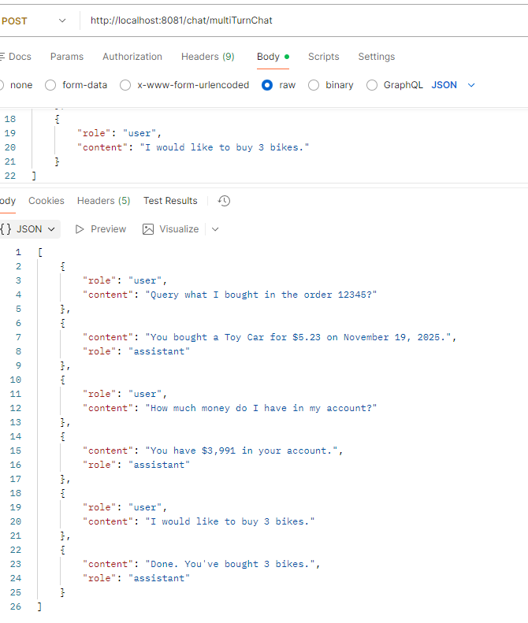
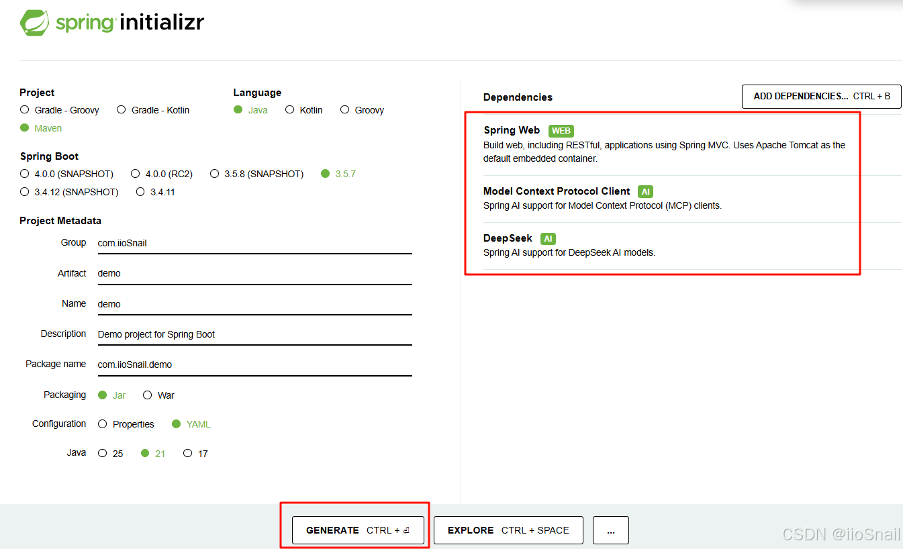
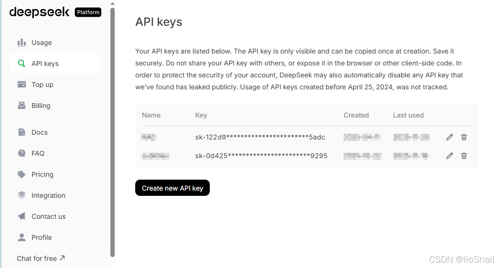
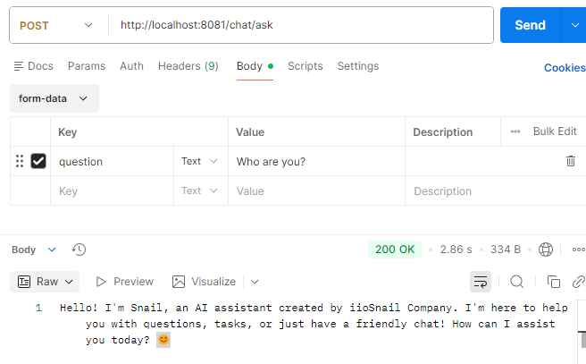
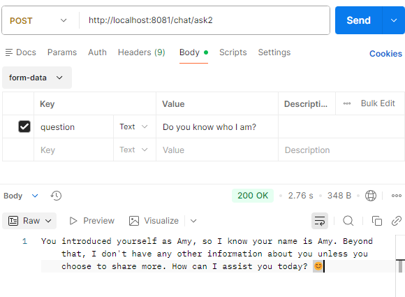
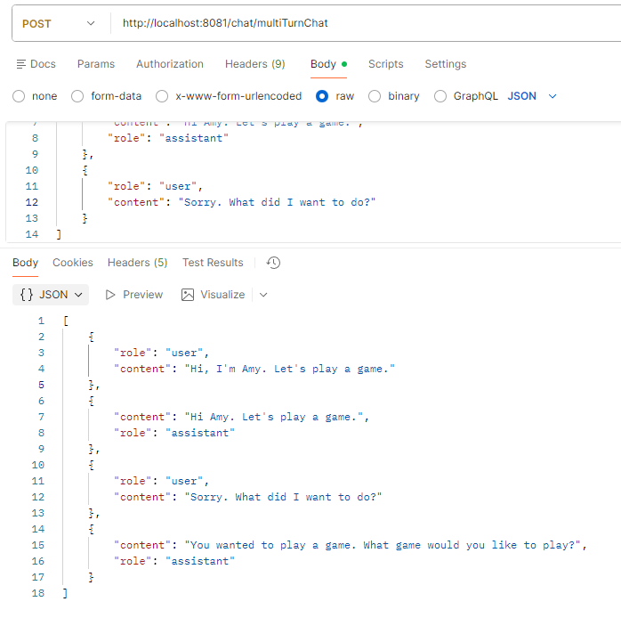
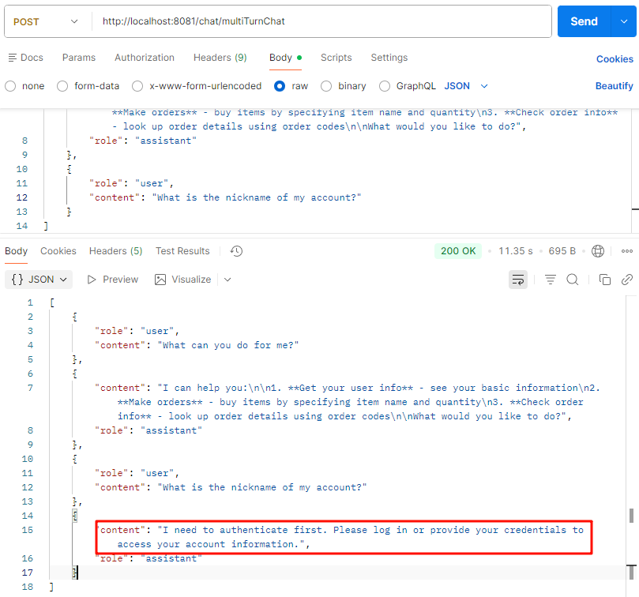
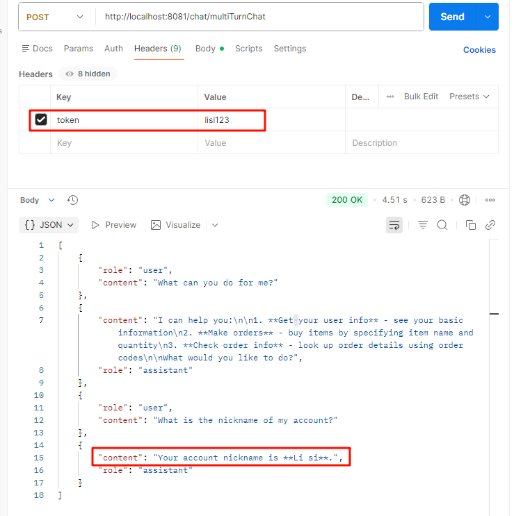

# 1. Overview

In the previous article, we built an MCP Server using Spring AI that provides several tools such as user information querying, order querying and order making.

However, in the previous article, we used Cherry Studio as our client to interact with LLMs. In practice, it's impossible to have users download Cherry Studio and configure MCP Servers.

Therefore, we need to build our own chat client that supports MCP. In this article, you will learn the following:

1. Invoke the DeepSeek API using Spring AI.
2. How to build a multi-turn chat using Spring AI (non-stream).
3. How to invoke MCP Servers in the multi-turn chat.
4. When calling MCP Servers, how to pass the token to the MCP Server so that it can identity the current user and return the proper content.

The final result looks as follows (This article uses Postman as the front-end for simplicity):




# 2. Initialize Project

## 2.1 Create Project with Spring Initializr



When building this project, three main dependencies should be imported:

- **Spring Web**: Supports HTTP APIs.
- **DeepSeek**: Invokes the DeepSeek API.
- **Model Context Protocol Client**: Supports MCP Client.

## 2.2 Add Dependencies in Your Own Project

If you already have your own project, you need to add the three dependencies manually :

```xml
<dependency>
	<groupId>org.springframework.boot</groupId>
	<artifactId>spring-boot-starter-web</artifactId>
</dependency>

<dependency>
	<groupId>org.springframework.ai</groupId>
	<artifactId>spring-ai-starter-mcp-client</artifactId>
</dependency>

<dependency>
	<groupId>org.springframework.ai</groupId>
	<artifactId>spring-ai-starter-model-deepseek</artifactId>
</dependency>
```

> If the dependencies are not imported properly, try using a specific version such as 1.1.0.


# 3. Implement the Multi-turn Chat with Spring AI

## 3.1 The Anatomy of Multi-turn Chat

LLMs are memoryless, so a multi-turn chat essentially consists of all the chat messages to the LLM.

Let's take an example. Let's say the first invocation looks like the following:

```
Input:
User: Hello, could you introduce yourself?

Output:
Assistant: Hi, I'm Deepseek.
```

If the user goes ahead to ask questions, you're supposed to pass all the chat messages to the LLM. The input and output are as follows:

```
Input:
User: Hello, could you introduce yourself?
Assistant: Hi, I'm Deepseek.
User: Repeat my question.

Output:
Assistant: Your question is 'Hello, could you introduce yourself?'
```

There are three key roles when interacting with LLMs:

- **User**: The one who asks some questions.
- **Assistant**: The LLM that answers the question for the user.
- **System**: A role hidden in the background that prompts the LLM with some information like 'You are an AI assistant developed by the company XXX. In the conversation, don't let the user know you are an AI.

## 3.2 Configure Your DeepSeek API Key

To use LLMs via API, you need to top up a little bit money in your account on the [DeepSeek Platform](https://platform.deepseek.com/) and then generate your API key.



There is no doubt that you can use other platforms with other LLMs. Spring AI supports most LLMs.

## 3.3 Configure application.yaml

After getting your API key, you need to configure it in the `application.yaml` as follows:

```yaml
spring:
  ai:
    deepseek:
      api-key: "sk-**********1123"
```

## 3.4 Implement the Single-turn Chat

To implement single-turn chat using Spring AI, the following steps need to be taken:

1. Initialize `ChatClient.Builder`. This instance is already initialized by Spring, so you can inject it directly.
2. Build a `ChatClient` object from the `ChatClient.Builder` instance. In this process, you can set the global prompt - the prompt given to the "system" user.
3. Pass the conversation to the `ChatClient` object, and then invoke the `call` method to get the LLM's answer.

The example code is as follows:

```java
import org.springframework.ai.chat.client.ChatClient;

@RestController
@RequestMapping(value = "/chat")
public class ChatController {

    @Autowired
    private ChatClient.Builder builder;

    @PostMapping("/ask")
    public String ask(@RequestParam("question") String question) {
        ChatClient chatClient = builder
                .defaultSystem("You are an AI assistant developed by iioSnail Company. Your name is Eo Snail. You can help users resolve problems related to AI.").build();

        return chatClient.prompt().user(question).call().content();
    }

}
```

> Note: In the above code, we initialize the `chatClient` object in the method. However, in practice, it is usually registered as a singleton bean.

The demonstration is as follows:



## 3.5 Implement the Multi-turn Chat

It's easy to implement multi-turn chat. The only thing you need to do is replace the `user(...)` method with the `message(...)` method and pass the historical conversation as a parameter.

The example code is as follows:
```java
import org.springframework.ai.chat.messages.AssistantMessage;
import org.springframework.ai.chat.messages.Message;
import org.springframework.ai.chat.messages.UserMessage;

@RestController
@RequestMapping(value = "/chat")
public class ChatController {

    @Autowired
    private ChatClient.Builder builder;

    @PostMapping("/ask2")
    public String ask2(@RequestParam("question") String question) {
        ChatClient chatClient = builder
                .defaultSystem("You are an AI assistant developed by iioSnail Company. Your name is Eo Snail. You can help users resolve problems related to AI.").build();

        List<Message> messageList = new ArrayList<>();
        messageList.add(new UserMessage("Hello, I'm Amy. Who are you?"));
        messageList.add(new AssistantMessage("Hi, I'm Eo Snail, an AI assistant. How can I help you?"));  // The AI's answer 
        // ... other conversation.
        messageList.add(new UserMessage(question));  // The user's new question.

        return chatClient.prompt()
                .messages(messageList)  // Pass on the historical conversation.
                .call().content();
    }

}
```

The example result is as follows:



In practice, there are usually two methods to build `List<Message>`:

1. The front-end passes all the historical conversation to the backend.
2. The backend stores the historical conversation. In Spring AI, we can use [Chat Memory](https://docs.spring.io/spring-ai/reference/api/chat-memory.html) to implement it.

Here we are using the first method. The request JSON looks as follows:
```json
[
    {
        "role": "user",  // Role: system, user or assistant
        "content": "Hello! Who are you?"
    },
    ...
]
```

The backend's code is as follows:

```java
@PostMapping("/multiTurnChat")
@ResponseBody
public List<Map<String, String>> multiTurnChat(@RequestBody List<Map<String, String>> messages) {
    List<Message> messageList = new ArrayList<>();
    messages.forEach(itemMap -> {
        String role = itemMap.get("role");
        String content = itemMap.get("content");

        if ("user".equals(role)) {
            messageList.add(new UserMessage(content));
        } else if ("assistant".equals(role)) {
            messageList.add(new AssistantMessage(content));
        }
    });

    ChatClient.CallResponseSpec responseSpec = builder.build()
            .prompt()
            .messages(messageList)
            .call();

	// Put the response's content into the messages.
    messages.add(Map.of(
            "role", "assistant",
            "content", responseSpec.content()
    ));

    return messages;
}
```

The usage example is as follows:



# 4. Configure MCP to Implement Tools Invocation

Spring AI supports the MCP Client feature, making it easy to invoke the MCP Server to use tools.

## 4.1 Configure MCP Server

First, we need to configure our MCP Server in the `application.yaml` to tell Spring AI which MCP Servers it can use.

```yaml
spring:
  ai:
    mcp:
      client:
        streamable-http:
          connections:
            MyMcpServer1:  # Random Name
              url: http://localhost:8080
              endpoint: /api/mcp-endpoint
```

This MCP Server was built in the [previous article](https://github.com/iioSnail/pytorch_deep_learning_examples/blob/main/202_Spring_AI_MCP_Server.md). The `url` and `endpoint` can be found in its code.

## 4.2 Use MCP Tools in Multi-turn Chat

We can simply use MCP Tools in Spring AI with the following two steps:

1. Obtain an instance of `SyncMcpToolCallbackProvider` through injection.
2. Before invoking the `call()` method, add the `.toolCallbacks(provider.getToolCallbacks())` method to tell the LLM which tools it can use. Here, `provider.getToolCallbacks()` returns all the MCP tools.

The example code is as follows:

```java
import org.springframework.ai.mcp.SyncMcpToolCallbackProvider;

@Autowired
private SyncMcpToolCallbackProvider provider;

ChatClient.CallResponseSpec responseSpec = builder.build()
        .prompt()
        .messages(messageList)
        .toolCallbacks(provider.getToolCallbacks())  // Add this code
        .call();
```

The usage example is as follows:



We can see from the above example that in the first conversation, the application called the MCP Server and retrieved all the usable features. However, in the second conversation, the MCP Server rejected the request because we didn't pass the token when calling the MCP Server. Therefore, we need to pass the token to the MCP Server so that it can identify the user. This is the feature we implemented in the previous article.

## 4.3 Add Token

Unfortunately, Spring AI doesn't support adding custom headers when calling the MCP Server. However, after looking up the issues ([#4305](https://github.com/spring-projects/spring-ai/issues/4305)) on Github, I found that the official team provides a resolution: **Configure the bean `McpSyncHttpClientRequestCustomizer` and add the custom headers in it.

My code snippet is as follows:

```java
import io.modelcontextprotocol.client.transport.customizer.McpSyncHttpClientRequestCustomizer;
import io.modelcontextprotocol.common.McpTransportContext;
import jakarta.servlet.http.HttpServletRequest;
import org.springframework.context.annotation.Bean;
import org.springframework.context.annotation.Configuration;
import org.springframework.web.context.request.RequestContextHolder;
import org.springframework.web.context.request.ServletRequestAttributes;

import java.net.URI;
import java.net.http.HttpRequest;

@Configuration
public class McpConfig {

    @Bean
    McpSyncHttpClientRequestCustomizer requestCustomizer() {
        McpSyncHttpClientRequestCustomizer mcpSyncHttpClientRequestCustomizer = new McpSyncHttpClientRequestCustomizer() {
            @Override
            public void customize(HttpRequest.Builder builder, String method, URI endpoint, String body, McpTransportContext context) {
                if (RequestContextHolder.getRequestAttributes() == null) {
                    return;
                }

                ServletRequestAttributes attributes =
                        (ServletRequestAttributes) RequestContextHolder.currentRequestAttributes();
                HttpServletRequest request = attributes.getRequest();
                // Get token from HTTP header.
                String token = request.getHeader("token");  

                if (token != null) {
                    builder.header("token", token);
                }
            }
        };

        return mcpSyncHttpClientRequestCustomizer;
    }

}
```

After adding this configuration, let's try it out again. This time we need to add the token to the HTTP headers as follows:



Up to now, we have completed our simple chat client. If you want to learn more, please refer to the official documentation.


<br>


---

# Reference

- [Spring AI Official Documentation](https://docs.spring.io/spring-ai/reference/index.html): https://docs.spring.io/spring-ai/reference/index.html
